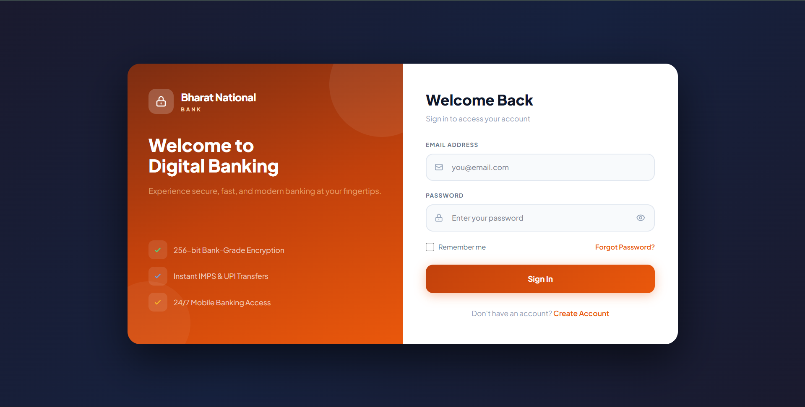
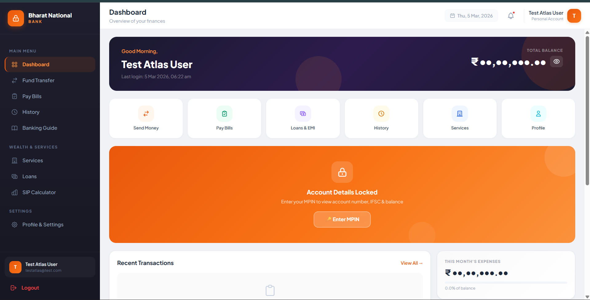
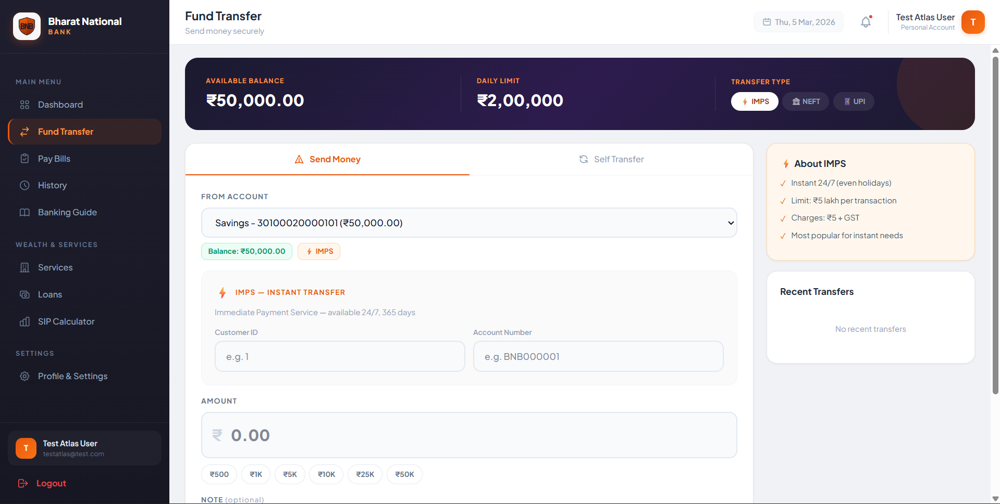
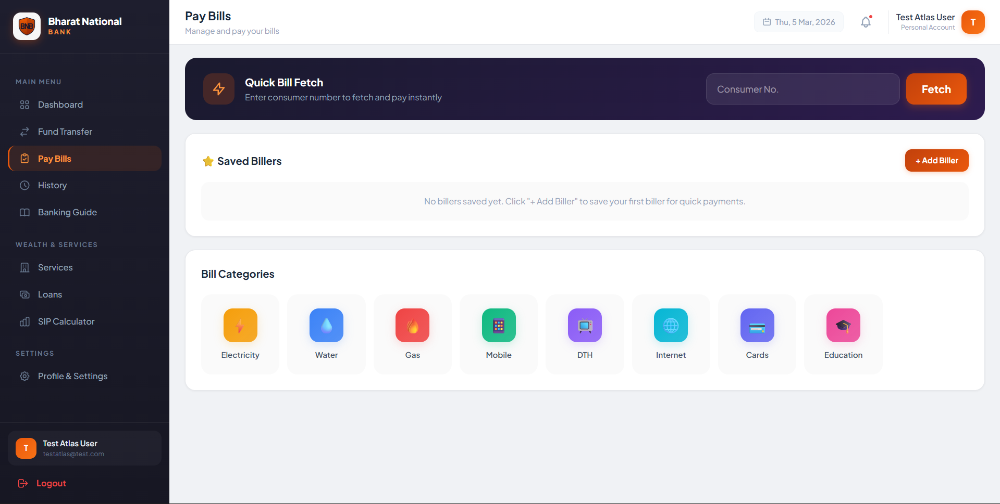
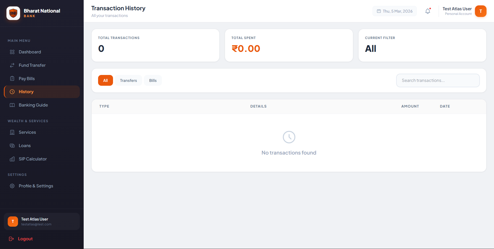
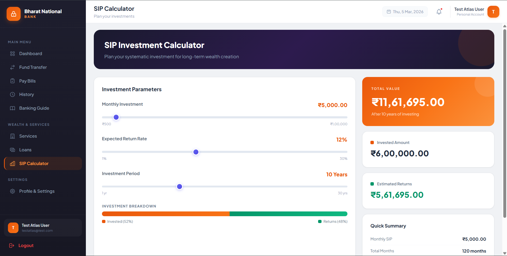

<div align="center">

# 🏦 Bharat National Bank — Digital Banking Platform

A full-stack, comprehensive digital banking simulator featuring a premium React-based UI, powerful Node.js/MongoDB backend, and an architecture built for learning modern web development.

    

**Author:** Souvik Samanta (CSE Student)

</div>

---

## 📸 Application Previews

Experience the premium, responsive UI built with React, Vite, and modern CSS:

| Login & Security | User Dashboard |
|:---:|:---:|
|  |  |
| *Secure Login with MPIN authentication* | *Comprehensive financial overview* |

| Funds Transfer | Utility Bill Payments |
|:---:|:---:|
|  |  |
| *Seamless IMPS/NEFT transfers* | *One-click utility payments* |

| Transaction History | Wealth Calculators |
|:---:|:---:|
|  |  |
| *Detailed & filterable transaction logs* | *SIP & Loan EMI planning tools* |

---

## 🔄 The Evolution: v1.0 to v2.0

Bharat National Bank recently underwent a massive architecture overhaul, moving from a monolithic vanilla JS setup to a modern React Single Page Application (SPA).

| Feature | v1.0 (Previous Legacy) | v2.0 (Current React App) |
|---------|-----------------------|--------------------------|
| **Frontend** | Vanilla HTML + JS (single file) | ⚡ React 19 + Vite (component-based) |
| **Styling** | Tailwind CDN + `style.css` | 🎨 Tailwind CSS v4 + Custom CSS Patterns |
| **Database** | MySQL (local) | ☁️ MongoDB Atlas (cloud cluster) |
| **UI Design** | Basic flat layout | ✨ Premium dark theme with glassmorphism |
| **Architecture** | Monolithic (`index.html` + `script.js`) | 🏗️ Component-based (pages, layouts, hooks) |
| **State Management** | Raw localStorage mutations | 🔄 React Context API (`AuthContext`) |
| **API Layer** | Inline, repeated fetch calls | 📡 Centralized API module (`api.js`) |
| **Routing** | Manual DOM section toggling | 🛣️ React Router v7 (Protected Routes) |
| **Pre-seeded Data** | None | 👥 30 demo users with extensive mock data |
| **Core Pages** | 4 Pages | 📄 10+ Modular Pages & Modals |
| **Calculators** | ❌ Not available | ✅ Advanced Loan EMI & SIP Calculators |

---

## ✨ Key Features

### Core Banking
- 🏦 **Dashboard** — Account summary, recent transactions, monthly expenses, visual spending charts.
- 💸 **Fund Transfer** — IMPS, NEFT, UPI transfers with pre-validation and success receipts.
- 📋 **Bill Payments** — Streamlined interface for electricity, mobile, broadband, water, and gas payments.
- 📊 **Transaction History** — Filtered & searchable unified history logging all monetary flows.

### Wealth Management & Services
- 🏠 **Loan Calculator** — EMI calculator featuring tenure comparison & a full amortization schedule.
- 📈 **SIP Calculator** — Systematic investment planner projecting long-term wealth returns.
- 🏪 **Banking Services** — Explore mock FD, RD, insurance, locker, and demat services.
- 📖 **Banking Guide** — Interactive tips and tooltips to educate users on digital banking features.

### Security & Privacy
- 🔒 **Dual-Layer Security** — Passwords for web access + MPIN protection for account-sensitive operations.
- 🔐 **Password Hashing** — Secure `bcrypt` integration with 10 salt rounds.
- 👤 **Profile Management** — Update personal info, check KYC status, and manage security settings.

---

## 🧱 Tech Stack

| Layer | Technology |
|-------|-----------|
| **Frontend UI** | React 19, Vite 7, HTML5, Vanilla CSS |
| **Styling** | Tailwind CSS v4 with custom variable extensions |
| **Routing** | React Router DOM v7 |
| **Backend API** | Node.js, Express.js |
| **Database** | MongoDB Atlas (Cloud) & Mongoose |
| **Authentication** | bcrypt password hashing + custom MPIN validation |
| **State Mgt.** | React Context API (`AuthContext`) |

---

## 📂 Project Structure

```text
Bharat-National-Bank/
├── client/                    # React Frontend (Powered by Vite)
│   ├── index.html
│   ├── vite.config.js         # Development config & API proxying
│   ├── src/
│   │   ├── main.jsx           # App entry point
│   │   ├── App.jsx            # Router & central layouts
│   │   ├── index.css          # Global theme variables & Tailwind imports
│   │   ├── api/               # API abstraction layer
│   │   ├── context/           # Global State (AuthContext)
│   │   ├── components/        # Reusable UI (Auth, Layout, Modals)
│   │   └── pages/             # Route endpoints (Dashboard, History, etc.)
│   └── package.json
├── server.js                  # Express backend & RESTful endpoints
├── package.json               # Backend dependencies & startup scripts
├── .env.example               # Template for environment variables
└── README.md                  # Project documentation
```

---

## ⚙️ Installation & Setup

### Prerequisites
- **Node.js**: v18 or newer.
- **MongoDB**: A free MongoDB Atlas cluster account.

### 1. Clone the Repository
```bash
git clone https://github.com/souvik082003/Bharat-National-Bank.git
cd Bharat-National-Bank
```

### 2. Configure Environment Variables
Create a `.env` file in the project root folder. You can copy the template:
```bash
cp .env.example .env
```
Ensure your `.env` contains:
```env
MONGO_URI=mongodb+srv://<username>:<password>@<cluster>.mongodb.net/bharatbank?retryWrites=true&w=majority
PORT=3000
```

### 3. Install Dependencies
```bash
# Install backend dependencies
npm install

# Install frontend dependencies
cd client
npm install
```

### 4. Boot Up the Servers
```bash
# Terminal 1 — Start the local Express Backend
npm start

# Terminal 2 — Start the Vite Frontend Development Server
cd client
npm run dev
```

### 5. Seed the Database
With both servers running, open a new terminal to seed the database with 30 mock accounts:
```bash
curl -X POST http://localhost:3000/api/seed
```

### 6. Open the App
Launch **http://localhost:5173** in your web browser.

---

## 👥 Demo Accounts

The database seeding provides 30 demo users. All accounts share the same credentials for easy testing:

- **Password**: `password123`
- **MPIN**: `123456`

**Sample Login Emails:**
- `rajesh.kumar@email.com`
- `priya.sharma@email.com`
- `arjun.patel@email.com`
- `sneha.reddy@email.com`
- `vikram.singh@email.com`

---

## 🤝 Contributing

Contributions are highly encouraged! If you'd like to help improve this educational project:

1. **Fork** the repository
2. **Create** your branch: `git checkout -b feature/amazing-feature`
3. **Commit** your changes: `git commit -m "feat: add amazing feature"`
4. **Push** to the branch: `git push origin feature/amazing-feature`
5. **Open a Pull Request** with a detailed description and screenshots of your UI changes!

---

## 📄 License & Contact

This project is open-sourced under the **Apache License 2.0**.

**Connect with the Author:**
- 📧 Email: work03.souvik@gmail.com
- 🐙 GitHub: [souvik082003](https://github.com/souvik082003)
- 💼 LinkedIn: [Souvik Samanta](https://www.linkedin.com/in/souvik-samanta-660130211/)

> ⭐ **Support the Project!** If Bharat National Bank helped you learn React or full-stack web development, please consider starring the repository and sharing it with your peers!
